# spc-lab — every SPC formula, drawn

Statistical Process Control formulas with nothing hidden. Control-chart constants are
**derived by Monte Carlo simulation** and verified against the AIAG table in tests, so the
library is its own proof.

Built by **Ammar** — SPC engineer in high-volume manufacturing.
Part of a portfolio that includes [Line of Sight](../line-of-sight.html), an interactive
SPC essay.

## The formulas, visualized

| Formula | What it means | Where to see it |
|---|---|---|
| `d₂ = E(R/σ)` | The expected range of *n* standard normals. It converts an average range R̄ into a σ estimate. Computed here by simulating 400 000 subgroups. | `ConstantsAct` · `viz.panel_constants` |
| `A₂ = 3/(d₂√n)` | Shrinks the 3σ distance so it can be applied to subgroup *means* (means vary less than individuals by √n). n=5 → 0.577, matching AIAG Table B. | `ConstantsAct` |
| `UCL/LCL = x̄̄ ± A₂R̄` | Control limits learned **from the process**, not the spec. Points outside them are not "bad parts" — they're evidence the process changed. | `SPCGallery` act 1 |
| `Cp = (USL−LSL)/6σ` | Potential capability if the process were perfectly centered. | `gallery.png` panel 3 |
| `Cpk = min(USL−μ, μ−LSL)/3σ` | Honest capability given where the mean *actually* sits. Cpk 1.33 ≈ 32 ppm; 1.0 ≈ 1 350 ppm; 0.8 ≈ 16 400 ppm. | `SPCGallery` act 2 |
| `DPMO` | Predicted defective parts per million from the normal tail; `shift=1.5` reproduces the Six Sigma convention (±6σ → 3.4 DPMO). | tested in `test_ppm_shift_convention` |
| EWMA limits `±Lσ√(λ/(2−λ)(1−(1−λ)^{2i}))` | Limits start wide-ish and tighten to ±3σ·√(λ/(2−λ)) as memory accumulates. Paired with exponentially-weighted data, this detects slow drift roughly twice as fast as Shewhart. | `EWMAMemory` |
| Western Electric rules 1–4 | Beyond-3σ point · 2-of-3 beyond 2σ same side · 4-of-5 beyond 1σ same side · 8-in-a-row same side. Patterns catch shifts *before* limits do. | `WERules` |

## Curriculum — “Why SPC works”

A four-level walk from raw variation to detection theory. Each level: exact sheets + a manim act.

### Level 1 — Variation is predictable
*The big idea:* individual parts are unpredictable; aggregates obey a law.
- 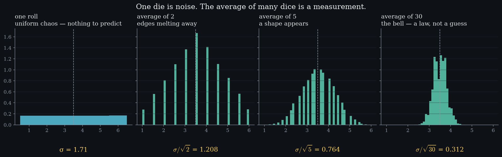 One die is uniform chaos; the average of 30 dice is a bell with σ/√30 the width. The yellow annotations are measured, not drawn: 2.449 → 0.447 → 0.447… each panel’s spread lands exactly on σ/√k.
- 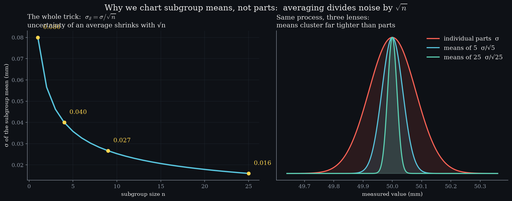 The √n curve itself — and the same process seen through three lenses (individuals vs means-of-5 vs means-of-25). This one curve is why control charts watch subgroup means.
- Video: `media/videos/level04_scene/1080p60/Level04.mp4` — histogram piling up live as rolls accumulate, then the σ/√n line deriving itself.

### Level 2 — Control limits are a hypothesis test
*The big idea:* ±3σ isn’t taste. If the process is stable, the sampling distribution from Level 1 tells you exactly how often a point lands outside: 0.27% → one false alarm per ~370 subgroups. A violation is a bet at 370:1 odds that something changed.
- 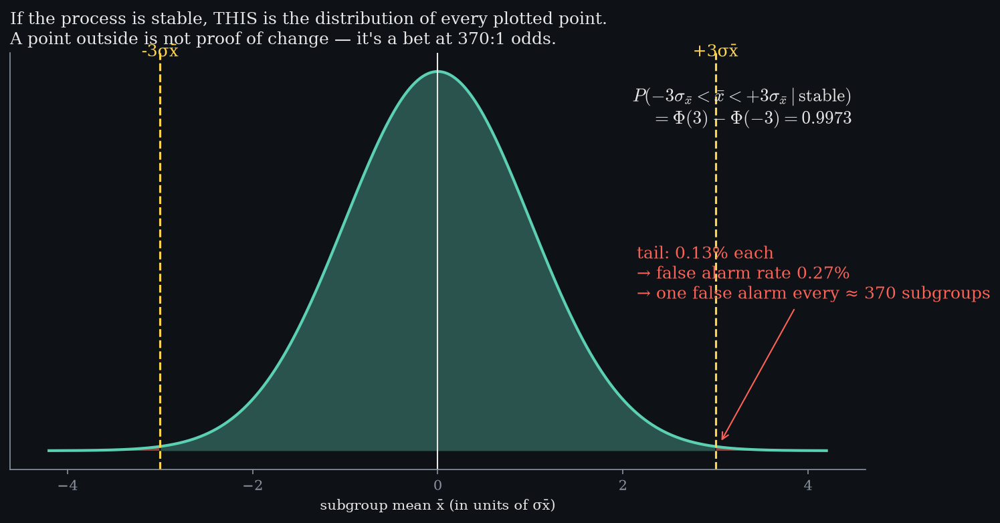 The null distribution of x̄ with the exact integral Φ(3)−Φ(−3) = 0.9973 and its tails annotated with the false-alarm arithmetic.
- 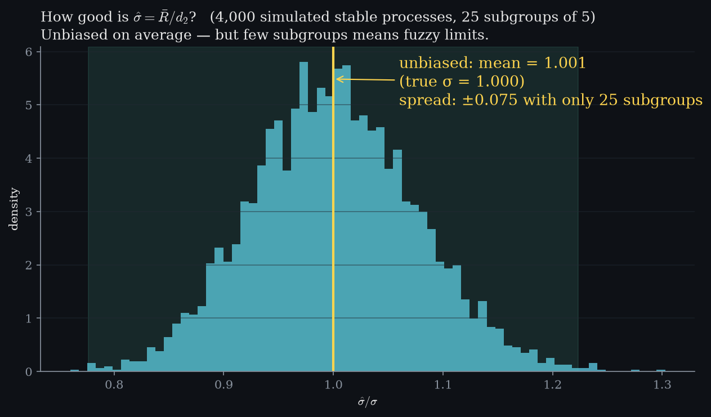 How good is σ̂ = R̄/d₂? 4 000 simulated stable processes: unbiased, but with only 25 subgroups the limits themselves carry real fuzz — why Phase I needs enough data.
- Video: `media/videos/level06_scene/1080p60/Level06.mp4` — the bell becomes a hypothesis, the ±3σ region fills to 99.73%, then the same picture wearing chart clothes: in-control points, one genuine shift, and the verdict “not a bad part — evidence against H₀”.

### Level 3 — Capability is comparing two distributions
*The big idea:* spec limits are the customer’s voice, the process distribution is the process’s voice. Cp is pure geometry (two widths compared); Cpk adds where the mean actually sits; every threshold is an exact tail integral.
- 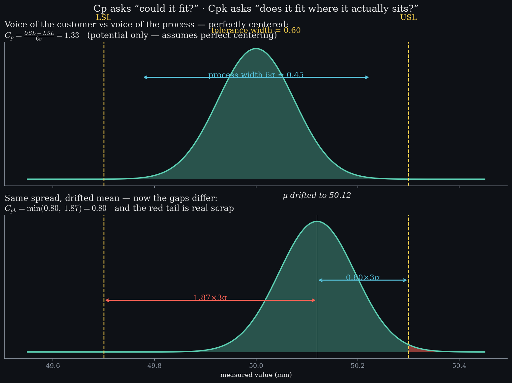 Both voices on one axis, twice: centered (Cp = width ratio) then drifted (Cpk = nearer gap ÷ 3σ), with dimension-line measurements.
- 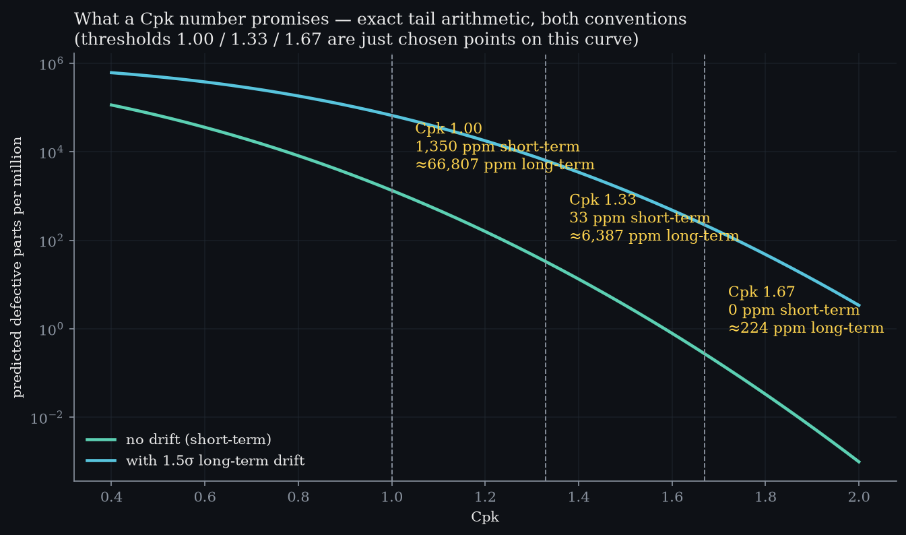 The exact mapping from Cpk to promised defects, both with and without the 1.5σ drift convention — showing 1.00/1.33/1.67 are just chosen points on a continuous curve.
- Video: `media/videos/level08_scene/1080p60/Level08.mp4` — tolerance bracket vs natural spread drawn as dimension lines; the bell drifts and its red tail grows; then the promise table: Cpk 0.80→16 400 ppm … 1.67→0.6 ppm.
Spec limits are the customer’s voice, control limits the process’s voice; Cpk measures their mismatch in tail-probability terms.

### Level 4 — Detection theory: EWMA/CUSUM & ARL *(planned)*
Charts as sequential hypothesis tests; evidence accumulation beats single points for slow drift.

### Level 4 — Detection theory: charts as evidence accumulators
*The big idea:* a chart is a sequential hypothesis test. Single points wait for extremes; EWMA/CUSUM accumulate evidence, catching slow drift far sooner — at the *same* false-alarm rate.
- 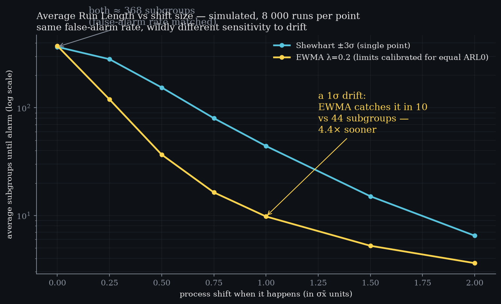 Simulated ARL vs shift size (8 000 runs/point), with the EWMA limits **calibrated to match Shewhart’s ARL₀ ≈ 368** so the comparison is honest: at 1σ drift, detection in ~10 subgroups vs ~44 — about 4× sooner.
- 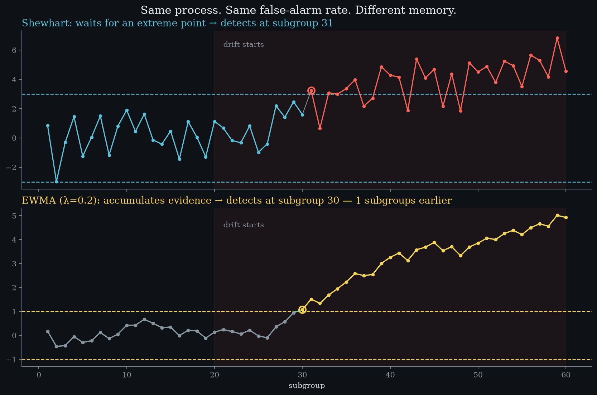 One drifting process, both charts racing: Shewhart waits for an extreme point; EWMA’s smoothed line crosses its tighter limit while every raw point still sits inside ±3σ.
- Video: `media/videos/level09_scene/1080p60/Level09.mp4` — drift hiding inside noise, then the memory-bearing line crossing its limit early. This is exactly Line C from [Line of Sight](../line-of-sight.html).

## Formula sheets — each formula plotted as itself

Every figure below is computed live by the library; the annotations are real numbers,
not decoration.

| Sheet | What it plots |
|---|---|
| 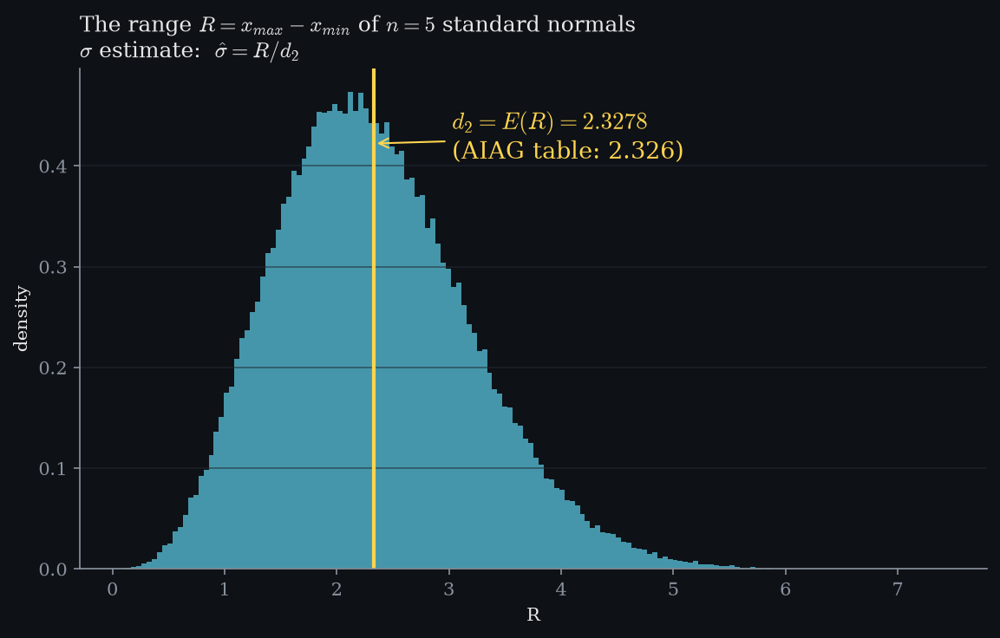 | **The sampling distribution of R itself** — 200 000 simulated ranges of n=5 normals. d₂ is literally the mean of this histogram: E(R) = 2.3257 (AIAG: 2.326). |
| 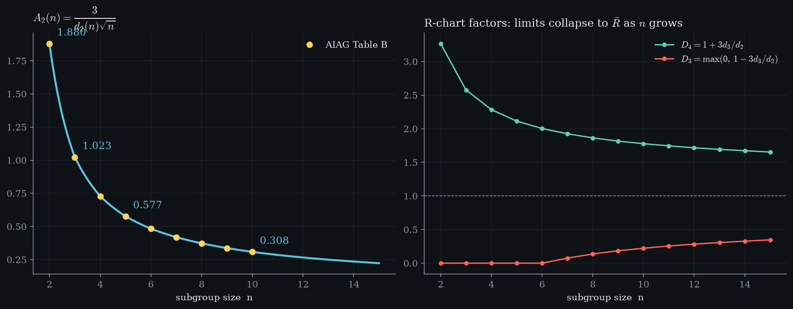 | **A₂(n) = 3/(d₂√n) as a continuous curve** with AIAG table points overlaid, plus D₃/D₄ showing why R-charts have no lower limit for small n. |
| 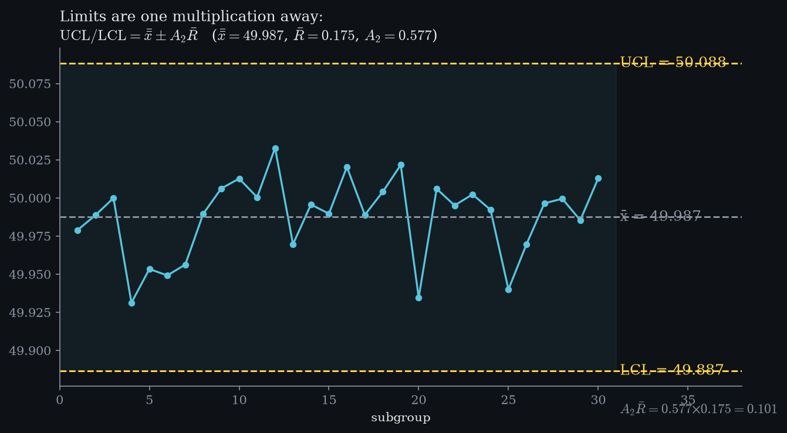 | **The limit arithmetic drawn on the chart** — UCL/LCL lines labeled with their actual values and the single multiplication that produced them: A₂R̄ = 0.577 × R̄. |
| 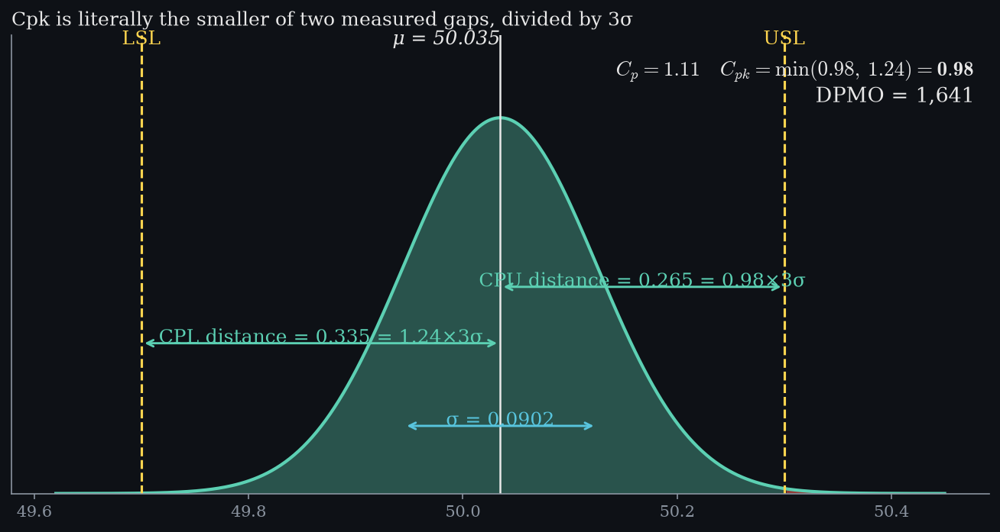 | **Cpk as measured distances** — dimension-line annotations for μ, σ, and both gaps (CPU/CPL); Cpk is visibly just the smaller gap ÷ 3σ. |
| 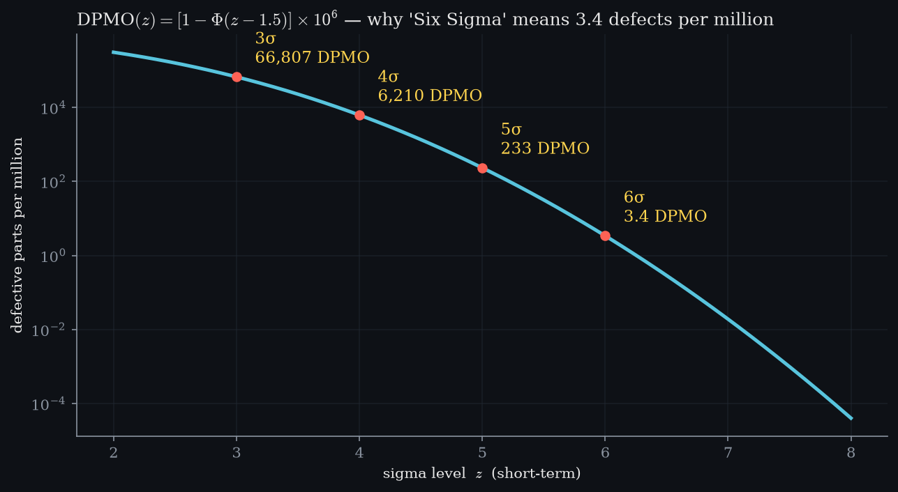 | **The sigma-level curve** DPMO(z) = [1−Φ(z−1.5)]·10⁶ — where 3σ/4σ/5σ/6σ actually land, and why "Six Sigma" means 3.4 defects per million. |
| 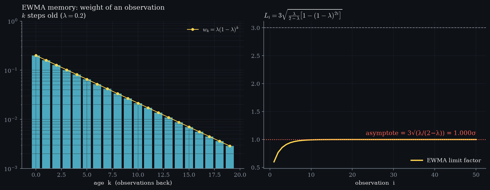 | **EWMA weight decay on a log scale** (w_k = λ(1−λ)^k) next to the exact limit-factor curve converging to its asymptote 3√(λ/(2−λ)). |
| 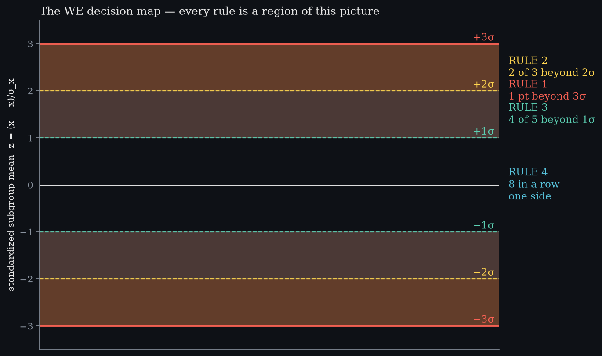 | **The WE decision map** — all four rules are regions of one standardized picture: zones at ±1σ/±2σ/±3σ plus the centerline run. |

## Videos (1080p60)

Rendered with Manim Community:

    media/videos/scenes/1080p60/SPCGallery.mp4      # intro + control limits + capability
    media/videos/scenes2/1080p60/ConstantsAct.mp4   # d₂ and A₂ derived
    media/videos/scenes2/1080p60/EWMAMemory.mp4     # weight decay + tightening limits
    media/videos/scenes2/1080p60/WERules.mp4        # all four rules firing on real patterns

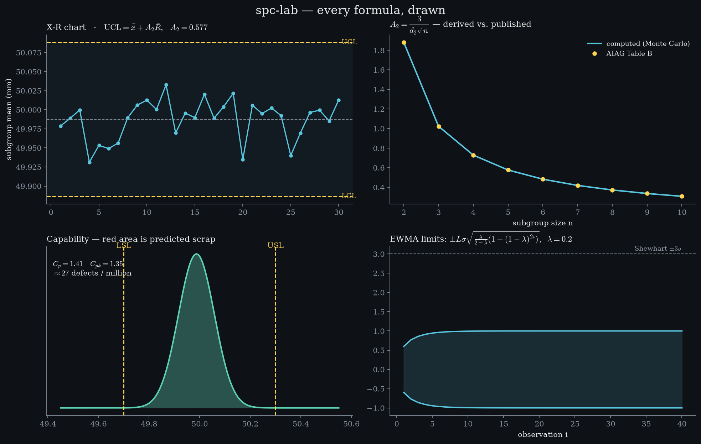

## Quick start

```bash
python3 -m venv .venv && .venv/bin/pip install numpy matplotlib pytest manim
PYTHONPATH=src .venv/bin/python -m pytest tests -q       # 7 passed
PYTHONPATH=src .venv/bin/python -m spclab.viz            # writes gallery.png
```

```python
import numpy as np
from spclab import xbar_r_limits, capability_indices, western_electric_violations

data = np.random.default_rng(7).normal(50, 0.08, size=(30, 5))  # 30 subgroups of 5
print(xbar_r_limits(data))
# {'xbarbar': 49.998..., 'ucl_xbar': 50.12..., 'lcl_xbar': 49.87..., 'A2': 0.577, ...}
```

## Design notes

- Constants are **computed, not tabulated** — if our d₂ disagrees with AIAG's, that's a test failure, not a mystery.
- Every formula lives next to a docstring citing where it comes from (AIAG SPC 2nd ed., Montgomery Ch. 5–6).
- Visualizations follow the 3Blue1Brown palette: cyan data, yellow derived quantities, red reserved for violations/spec breaches.

## Roadmap

- [ ] Chart classes: `XbarR(df).plot()`, pandas-native API
- [ ] Gage R&R (crossed ANOVA) module
- [ ] Publish to PyPI
